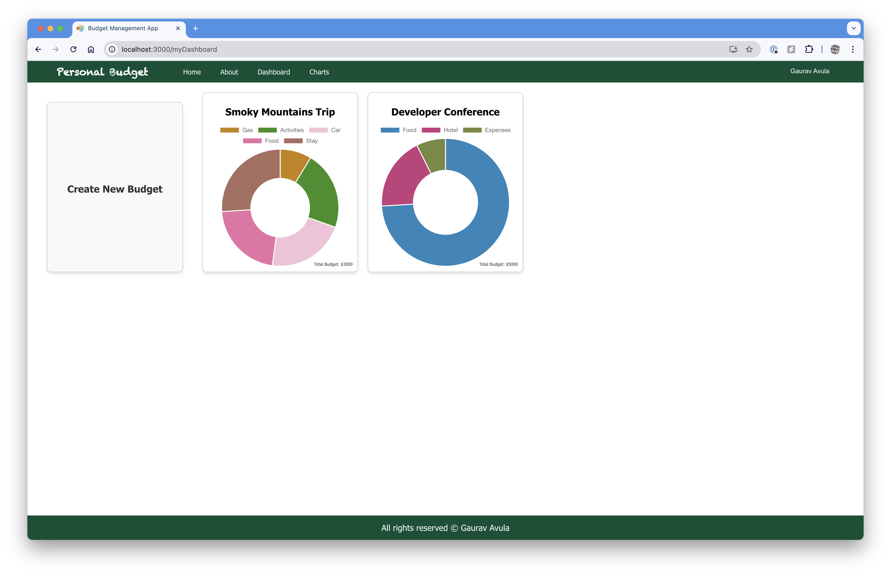

# Budget-Management-App
📊 Budget Management App — Master Your Finances with Ease

---

## Table of Contents

- [Project Name](#project-name)
- [Description](#description)
- [Features](#features)
- [Screenshots](#screenshots)
- [Testing](#testing)
- [Usage](#usage)
- [Run Locally](#run-locally)
- [Contact](#contact)

---

## Description

Welcome to Personal Budget, your all-in-one personal finance management app. With Personal Budget, you can take control of your finances, create and manage budgets, and track your expenses efficiently.

---

## Features

- **Create New Budgets**: Define budgets for different aspects of your life, such as groceries, entertainment, travel, and more. Be in charge of your spending and saving goals.
- **Add Items to Budgets**: Easily add and categorize expenses within each budget to monitor your spending. Stay organized and make informed financial decisions.
- **Track Your Expenses**: Keep a close eye on your financial activities with detailed insights and reports. Personal Budget helps you stay on top of your financial health.
- **User-Friendly Interface**: Our app is designed with simplicity and user-friendliness in mind. No more financial jargon; we provide an intuitive experience for users of all levels.

---

## 📸 Screenshots

| Screen | Description |
|--------|-------------|
|  | 🧭 **Landing page** where users can sign up |
|  | 📠**About page** with key features |
|  | 🔠**Login page** with email/password and Google sign-in |
|  | 🧾 **Dashboard** showing budgets |
|  | 💸 **Budget details** with chart and item input |
|  | 📊 **Bar chart view** of monthly expenses |
|  | 📈 **Line chart view** of expenses |
|  | 🧑‍💼 **Account settings** to update name, email, and password |

---

## 🧪 Testing

#### Visual Regression Testing with Applitools


#### End-to-End Testing with Cypress


#### Unit Testing with Jest


---

## Usage

- Make sure you use a **valid email**; verification is required to access the app.
- You can **add or delete budgets** in the dashboard.
- Use the **"Create New Budget"** button to start.
- Click on budget cards to **view and manage expenses**.
- Charts page is for **view-only** access of budget trends.

---

## 🚀 Run Locally

### Backend

1. Navigate to the `backend/` folder.
2. Go to **Firebase Console > Firestore Database**
    - Click "Create database" and set up Firestore in test mode.
3. Go to **Project Settings > Service Accounts > Generate new private key**
4. Rename the downloaded file to:
   ```
   firebase-config.json
   ```
5. Move the firebase-config.json file into:
   ```
   src/main/resources/
   ```
6. Run or start the Spring Boot application:
   ```bash
   ./mvnw spring-boot:run
   ```

### Frontend

1. Navigate to the `frontend/` folder (It takaes some time to install node modules).
2. Run:
   ```bash
   npm install
   ```

3. Go to [Firebase Console](https://console.firebase.google.com/)
    - Enable **Authentication > Sign-in method**
    - Enable **Email/Password**
    - Enable **Google**

4. Go to **Firebase Console → Project Settings → Add App → Web App**, and copy the Firebase SDK configuration. 
5. Replace the existing secrets with these new credentials in your frontend .env file.

---

## Contact

For any inquiries or feedback, feel free to reach out:

📧 [sudo@gauravavula.com](mailto:sudo@gauravavul.com)
🌐 [gauravavula.com](https://gauravavula.com)

---
© All rights reserved — Gaurav Avula


---
## 🪪 License

This project is licensed under the [MIT License](LICENSE).
